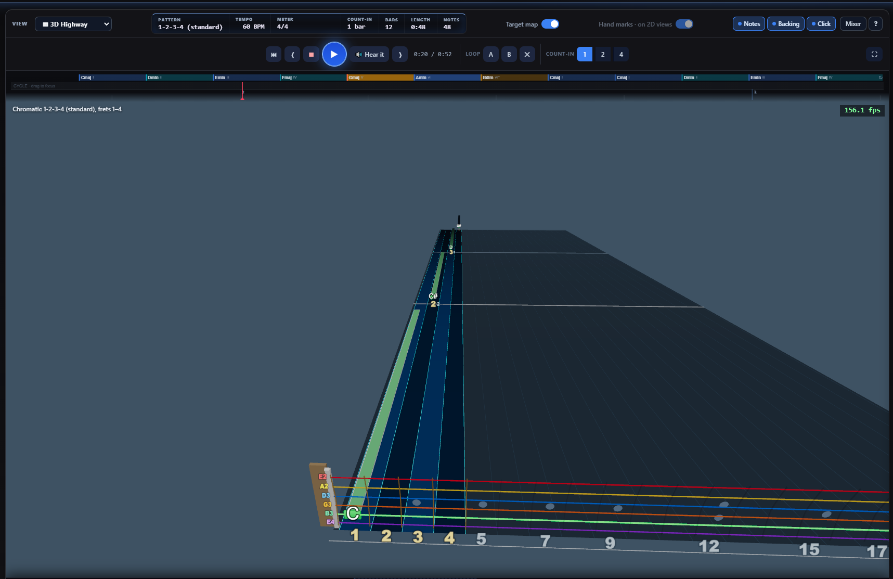

# Highway Notation

Draws the note letter (A–G♯) on every fret, on both the 3D Highway and the classic 2D Highway.

**[Download Windows installer](https://github.com/MajorMokoto/Highway-Notation/releases/latest/download/Install-HighwayNotation.exe)** — or **[download the zip](https://github.com/MajorMokoto/Highway-Notation/releases/latest/download/Highway-Notation.zip)** for manual install / other platforms

## Installation

### Windows — automatic

Run **Install-HighwayNotation.exe**. It finds your FeedBack install automatically, asks to confirm, and copies everything into place. Requires admin rights (it'll prompt).

### Manual (all platforms)

This isn't a single drop-in plugin — the download has three folders, and they don't all go to the same place. Please place each folder in the locations listed below. Overwrite existing files.

1. **Highway Notation Plugin**
   `highway_notation` folder install location: `feedback\current\resources\slopsmith\plugins\`

2. **Updated 3D Highway** (Required for notes to display on 3D Highway)
   `highway_3d` folder install location: `feedback\current\resources\slopsmith\plugins\`

3. **Updated 2D Highway** (Required for notes to display on 2D Highway)
   `static` folder install location: `feedback\current\resources\slopsmith\`

Paths above are for Windows. On other platforms, the `resources\slopsmith\` folder lives in a different place:

- **Windows**: `C:\Program Files\feedback\current\resources\slopsmith\plugins\`
- **macOS**: `/Applications/FeedBack.app/Contents/Resources/slopsmith/`
- **Linux**: varies by install method — an AppImage needs to be extracted (`--appimage-extract`) to get a real folder to drop files into; a `.deb` install is likely under `/opt/Feedback/resources/slopsmith/`

## 3D Highway

<table><tr>
<td width="50%"> Default</td>
<td width="50%"> Hardmode — gems hidden</td>
</tr></table>

## 2D Highway

<table><tr>
<td width="50%"> Default</td>
<td width="50%"> Hardmode — gems hidden</td>
</tr></table>

Letter position can be dragged off the fret number

## Virtuoso

> The settings pane needs to be opened before switching to Virtuoso — Virtuoso doesn't currently expose the Panes sidebar itself. This will be fixed in a future Virtuoso update to let the notation settings be opened directly from within it.

## Settings

Opens as a floating pane from the sidebar's Panes popup.

<table><tr>
<td width="50%"></td>
<td width="50%"></td>
</tr></table>
